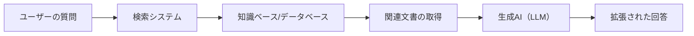
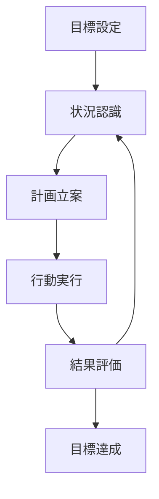
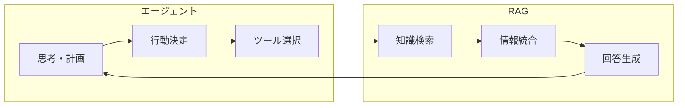

# RAGとエージェント - 生成AI視点からの詳細解説

## 📚 目次
1. [RAG（Retrieval-Augmented Generation）とは](#rag（retrieval-augmented-generation）とは)
2. [エージェント（AI Agent）とは](#エージェント（ai-agent）とは)
3. [RAGとエージェントの関係性](#ragとエージェントの関係性)
4. [実装パターンと活用例](#実装パターンと活用例)
5. [技術的な構成要素](#技術的な構成要素)
6. [最新のトレンドと今後の展望](#最新のトレンドと今後の展望)

---

## 🎯 RAG（Retrieval-Augmented Generation）とは

### 基本概念
**RAG**は、「検索拡張生成」と訳され、**外部の知識ベースから関連情報を検索し、それを基に生成AIが回答を生成する技術**です。



### なぜRAGが必要なのか？

#### 1. **知識のカットオフ問題の解決**
```plaintext
❌ 従来のLLM：「2024年のオリンピックについて教えて」
→ 訓練データが2023年までなので答えられない

✅ RAG搭載LLM：「2024年のオリンピックについて教えて」
→ 最新のデータベースから情報を検索して回答
```

#### 2. **ハルシネーション（幻覚）の軽減**
- 生成AIは時に存在しない情報を作り出す
- RAGは実際のデータに基づいて回答するため、精度が向上

#### 3. **専門知識への対応**
- 企業の内部文書や専門領域の知識を活用可能
- プライベートな情報でも安全に利用できる

### RAGの仕組み（詳細）

```python
# RAGの基本的な処理フロー（概念的なコード）
class RAGSystem:
    def __init__(self):
        self.retriever = DocumentRetriever()  # 検索システム
        self.generator = LLM()               # 生成AI
        
    def process_query(self, user_query):
        # 1. クエリのベクトル化
        query_embedding = self.embed(user_query)
        
        # 2. 関連文書の検索（類似度検索）
        relevant_docs = self.retriever.search(
            query_embedding, 
            top_k=5  # 上位5件を取得
        )
        
        # 3. コンテキストの構築
        context = self.build_context(relevant_docs)
        
        # 4. プロンプトの生成
        prompt = f"""
        以下の情報を基に質問に答えてください。
        
        コンテキスト：
        {context}
        
        質問：{user_query}
        
        回答：
        """
        
        # 5. 生成AIによる回答生成
        response = self.generator.generate(prompt)
        
        return response
```

### RAGの主要コンポーネント

#### 1. **エンベディングモデル**
- テキストを数値ベクトルに変換
- OpenAI Embeddings、Sentence-BERT、日本語BERTなど

#### 2. **ベクトルデータベース**
- 高速な類似度検索を実現
- Pinecone、Weaviate、Chroma、Faissなど

#### 3. **リトリーバー（検索器）**
- 密ベクトル検索（Dense Retrieval）
- スパースベクトル検索（BM25など）
- ハイブリッド検索

#### 4. **リランカー**
- 検索結果の再順位付け
- より関連性の高い文書を選択

---

## 🤖 エージェント（AI Agent）とは

### 基本概念
**AIエージェント**は、**目標を達成するために自律的に思考し、計画を立て、行動を実行する生成AIシステム**です。

### エージェントの特徴



### エージェントの主要な能力

#### 1. **自律的な思考と推論**
```python
class AIAgent:
    def think(self, task):
        """タスクを分析し、実行計画を立てる"""
        steps = []
        
        # タスクの分解
        subtasks = self.decompose_task(task)
        
        # 各サブタスクの実行順序を決定
        for subtask in subtasks:
            required_tools = self.identify_tools(subtask)
            steps.append({
                'task': subtask,
                'tools': required_tools,
                'dependencies': self.check_dependencies(subtask)
            })
        
        return self.create_execution_plan(steps)
```

#### 2. **ツールの使用**
- ウェブ検索
- コード実行
- ファイル操作
- API呼び出し
- データベースアクセス

#### 3. **メモリと学習**
- **短期記憶**：現在のタスクのコンテキスト
- **長期記憶**：過去の経験や知識
- **エピソード記憶**：特定のタスクの実行履歴

### エージェントのアーキテクチャパターン

#### 1. **ReAct（Reasoning and Acting）**
```plaintext
思考 → 行動 → 観察 → 思考 → ...
```

#### 2. **Plan-and-Execute**
```plaintext
計画立案 → 実行 → 評価 → 再計画（必要に応じて）
```

#### 3. **Multi-Agent System**
```plaintext
Agent1（検索担当） ← 協調 → Agent2（分析担当）
        ↓                      ↓
Agent3（実装担当） ← 協調 → Agent4（検証担当）
```

---

## 🔗 RAGとエージェントの関係性

### 相補的な関係



### 統合パターン

#### 1. **RAGを搭載したエージェント**
```python
class RAGAgent:
    def __init__(self):
        self.rag_system = RAGSystem()
        self.tools = {
            'search': self.rag_search,
            'analyze': self.analyze_data,
            'execute': self.execute_code
        }
    
    def solve_task(self, task):
        # RAGで必要な情報を検索
        context = self.rag_system.retrieve(task)
        
        # 情報を基に計画を立案
        plan = self.create_plan(task, context)
        
        # 計画を実行
        results = []
        for step in plan:
            if step.requires_knowledge:
                # RAGで追加情報を取得
                info = self.rag_system.retrieve(step.query)
                step.context = info
            
            result = self.execute_step(step)
            results.append(result)
        
        return self.synthesize_results(results)
```

#### 2. **エージェント群によるRAGの強化**
- **検索エージェント**：最適なクエリを生成
- **評価エージェント**：検索結果の品質を評価
- **統合エージェント**：複数の情報源を統合

---

## 💡 実装パターンと活用例

### 1. **カスタマーサポートエージェント**

```python
class CustomerSupportAgent:
    def __init__(self):
        self.rag = RAGSystem(knowledge_base="product_docs")
        self.sentiment_analyzer = SentimentAnalyzer()
        self.ticket_system = TicketSystem()
    
    def handle_inquiry(self, customer_message):
        # 感情分析
        sentiment = self.sentiment_analyzer.analyze(customer_message)
        
        # RAGで関連情報を検索
        solutions = self.rag.search_solutions(customer_message)
        
        # 優先度の判定
        if sentiment == "angry" or "urgent" in customer_message:
            self.ticket_system.escalate(customer_message)
        
        # 回答の生成
        response = self.generate_response(solutions, sentiment)
        
        return response
```

### 2. **コード生成エージェント**

```python
class CodingAgent:
    def __init__(self):
        self.rag = RAGSystem(knowledge_base="code_repository")
        self.code_executor = CodeExecutor()
        self.test_runner = TestRunner()
    
    def generate_code(self, requirements):
        # 1. 類似のコード例を検索
        examples = self.rag.search_similar_code(requirements)
        
        # 2. コードを生成
        generated_code = self.create_code(requirements, examples)
        
        # 3. テストを実行
        test_results = self.test_runner.run(generated_code)
        
        # 4. エラーがあれば修正
        while not test_results.passed:
            error_context = self.rag.search_error_solutions(
                test_results.errors
            )
            generated_code = self.fix_code(
                generated_code, 
                error_context
            )
            test_results = self.test_runner.run(generated_code)
        
        return generated_code
```

### 3. **研究支援エージェント**

```python
class ResearchAgent:
    def __init__(self):
        self.paper_rag = RAGSystem(knowledge_base="academic_papers")
        self.web_search = WebSearchTool()
        self.summarizer = Summarizer()
    
    def conduct_research(self, topic):
        research_plan = {
            'literature_review': [],
            'key_findings': [],
            'gaps': [],
            'recommendations': []
        }
        
        # 1. 関連論文の検索
        papers = self.paper_rag.search_papers(topic)
        
        # 2. 各論文の要約
        for paper in papers:
            summary = self.summarizer.summarize(paper)
            research_plan['literature_review'].append(summary)
        
        # 3. 知識のギャップを特定
        gaps = self.identify_research_gaps(
            research_plan['literature_review']
        )
        research_plan['gaps'] = gaps
        
        # 4. 推奨事項の生成
        recommendations = self.generate_recommendations(gaps)
        research_plan['recommendations'] = recommendations
        
        return research_plan
```

---

## 🛠️ 技術的な構成要素

### RAGの最適化技術

#### 1. **チャンク戦略**
```python
# 適応的チャンキング
def adaptive_chunking(document):
    chunks = []
    
    # セマンティックな境界で分割
    sections = split_by_sections(document)
    
    for section in sections:
        if len(section) > MAX_CHUNK_SIZE:
            # 大きすぎる場合は段落で分割
            paragraphs = split_by_paragraphs(section)
            chunks.extend(paragraphs)
        else:
            chunks.append(section)
    
    # オーバーラップを追加（文脈の保持）
    chunks_with_overlap = add_overlap(chunks, overlap_size=100)
    
    return chunks_with_overlap
```

#### 2. **ハイブリッド検索**
```python
def hybrid_search(query, documents):
    # 密ベクトル検索
    dense_results = vector_search(query, documents)
    
    # キーワード検索（BM25）
    sparse_results = bm25_search(query, documents)
    
    # スコアの正規化と結合
    combined_scores = normalize_and_combine(
        dense_results, 
        sparse_results,
        alpha=0.7  # 密ベクトル検索の重み
    )
    
    return rank_by_score(combined_scores)
```

### エージェントの高度な機能

#### 1. **Chain of Thought（思考の連鎖）**
```python
class ChainOfThoughtAgent:
    def reasoning_prompt(self, problem):
        return f"""
        問題: {problem}
        
        ステップごとに考えてみましょう：
        
        1. まず、問題を理解します：
           [問題の分析]
        
        2. 必要な情報を特定します：
           [必要な情報のリスト]
        
        3. 解決策を考えます：
           [可能な解決策]
        
        4. 最適な解決策を選択します：
           [選択理由と解決策]
        
        最終的な答え：
        """
```

#### 2. **Self-Reflection（自己反省）**
```python
class SelfReflectiveAgent:
    def execute_with_reflection(self, task):
        max_attempts = 3
        
        for attempt in range(max_attempts):
            # 実行
            result = self.execute(task)
            
            # 自己評価
            evaluation = self.evaluate_result(result)
            
            if evaluation.is_satisfactory:
                return result
            
            # 改善点の特定
            improvements = self.identify_improvements(
                result, 
                evaluation.feedback
            )
            
            # タスクの修正
            task = self.refine_task(task, improvements)
        
        return result
```

---

## 🚀 最新のトレンドと今後の展望

### 現在のトレンド（2024-2025）

#### 1. **マルチモーダルRAG**
- テキストだけでなく、画像、音声、動画も検索対象に
- Vision-Language Modelとの統合

#### 2. **GraphRAG**
- 知識グラフを活用した高度な推論
- エンティティ間の関係性を考慮した検索

#### 3. **Agentic RAG**
- エージェントが動的にRAGパイプラインを最適化
- クエリの自動改善と検索戦略の適応

#### 4. **Long Context Window対応**
- 100万トークン以上のコンテキストを扱えるモデル
- RAGの必要性の再評価と新しい使い方

### 実装上の考慮事項

#### 1. **コスト最適化**
```python
class CostOptimizedRAG:
    def __init__(self):
        self.cache = LRUCache(maxsize=1000)
        self.embedding_cache = {}
    
    def retrieve(self, query):
        # キャッシュの確認
        if query in self.cache:
            return self.cache[query]
        
        # エンベディングの再利用
        if query in self.embedding_cache:
            query_embedding = self.embedding_cache[query]
        else:
            query_embedding = self.embed(query)
            self.embedding_cache[query] = query_embedding
        
        # 段階的検索（コスト削減）
        initial_results = self.fast_search(query_embedding, top_k=20)
        
        if self.needs_refinement(initial_results):
            refined_results = self.detailed_search(
                query_embedding, 
                candidates=initial_results
            )
            return refined_results
        
        return initial_results
```

#### 2. **セキュリティとプライバシー**
```python
class SecureRAGAgent:
    def __init__(self):
        self.access_controller = AccessController()
        self.data_sanitizer = DataSanitizer()
    
    def process_request(self, user_id, query):
        # アクセス権限の確認
        permissions = self.access_controller.get_permissions(user_id)
        
        # 検索範囲の制限
        search_scope = self.define_scope(permissions)
        
        # 検索実行
        results = self.rag_search(query, scope=search_scope)
        
        # 機密情報のマスキング
        sanitized_results = self.data_sanitizer.sanitize(
            results, 
            user_permissions=permissions
        )
        
        return sanitized_results
```

### 今後の展望

#### 1. **完全自律型エージェント**
- 人間の介入なしに複雑なタスクを完遂
- 自己改善機能を持つエージェント

#### 2. **分散型RAGシステム**
- ブロックチェーン技術を活用した分散知識ベース
- プライバシー保護型連合学習

#### 3. **ニューロシンボリックAI統合**
- 記号的推論と深層学習の融合
- より説明可能で信頼性の高いシステム

---

## 📝 まとめ

### RAGとエージェントの使い分け

| 特徴 | RAG | エージェント |
|------|-----|------------|
| **主な用途** | 知識ベースの質問応答 | 複雑なタスクの自動化 |
| **必要な能力** | 情報検索と統合 | 計画立案と実行 |
| **適用範囲** | 特定知識領域 | 汎用的な問題解決 |
| **実装の複雑さ** | 中程度 | 高い |
| **コスト** | 低〜中 | 中〜高 |

### ベストプラクティス

1. **小さく始める**
   - まずは基本的なRAGから実装
   - 徐々にエージェント機能を追加

2. **評価メトリクスの設定**
   - 検索精度（Precision/Recall）
   - 回答の質（BLEU、ROUGE）
   - タスク完了率

3. **継続的な改善**
   - ユーザーフィードバックの収集
   - エラーログの分析
   - モデルとプロンプトの最適化

4. **倫理的配慮**
   - バイアスの監視と軽減
   - 透明性の確保
   - プライバシー保護

### 実装を始めるためのリソース

#### オープンソースフレームワーク
- **LangChain**：RAGとエージェントの構築
- **LlamaIndex**：データ連携とRAG特化
- **AutoGPT**：自律エージェントの実装
- **CrewAI**：マルチエージェントシステム

#### 学習リソース
- [OpenAI Cookbook](https://github.com/openai/openai-cookbook)
- [LangChain Documentation](https://python.langchain.com/)
- [Hugging Face Course](https://huggingface.co/course)

---

*この解説は2025年9月時点の情報に基づいています。AI技術は急速に進化しているため、最新の情報も合わせてご確認ください。*
